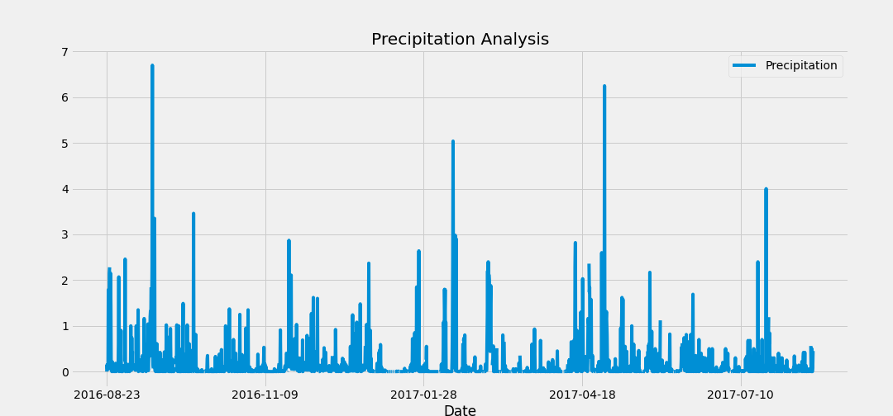
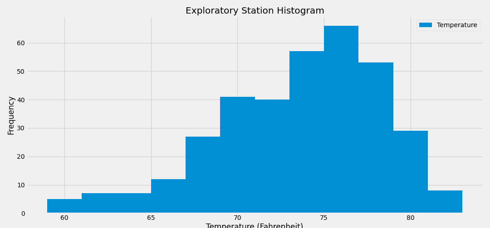

# SQLAlchemy-Challenge

## Step 1 - Climate Analysis and Exploration

Used Python and SQLAlchemy to do basic climate analysis and data exploration of a climate database. All of the following analysis was completed using SQLAlchemy ORM queries, Pandas, and Matplotlib.

* Used the provided [starter notebook](climate_analysis.ipynb) and [hawaii.sqlite](Resources/hawaii.sqlite) files to complete the climate analysis and data exploration.

* Used SQLAlchemy `create_engine` to connect to the sqlite database.

* Used SQLAlchemy `automap_base()` to reflect the tables into classes and saved a reference to those classes called `Station` and `Measurement`.

* Linked Python to the database by creating an SQLAlchemy session.

### Precipitation Analysis

* Started by finding the most recent date in the data set.

* Using this date, retrieved the last 12 months of precipitation data by querying the 12 preceding months of data. 

* Selected only the `date` and `prcp` values.

* Loaded the query results into a Pandas DataFrame and set the index to the date column.

* Sorted the DataFrame values by `date`.

* Plotted the results using the DataFrame `plot` method.

  

* Used Pandas to print the summary statistics for the precipitation data.

### Station Analysis

* Designed a query to calculate the total number of stations in the dataset.

* Designed a query to find the most active stations (i.e. which stations have the most rows?).

  * Listed the stations and observation counts in descending order.

  * Using the most active station id, calculated the lowest, highest, and average temperature.

* Designed a query to retrieve the last 12 months of temperature observation data (TOBS).

  * Filtered by the station with the highest number of observations.

  * Queried the last 12 months of temperature observation data for this station.

  * Plotted the results as a histogram with `bins=12`.

    
    
    
## Step 2 - Climate App

Designed a Flask API based on the queries that were just developed.

* Used Flask to create the routes.

### Routes

* `/`

  * Home page.

  * Lists all routes that are available.

* `/api/v1.0/precipitation`

  * Converts the query results to a dictionary using `date` as the key and `prcp` as the value.

  * Returns the JSON representation of your dictionary.

* `/api/v1.0/stations`

  * Returns a JSON list of stations from the dataset.

* `/api/v1.0/tobs`
  * Queries the dates and temperature observations of the most active station for the last year of data.

  * Returns a JSON list of temperature observations (TOBS) for the previous year.

* `/api/v1.0/<start>` and `/api/v1.0/<start>/<end>`

  * Returns a JSON list of the minimum temperature, the average temperature, and the max temperature for a given start or start-end range.

  * When given the start only, calculates `TMIN`, `TAVG`, and `TMAX` for all dates greater than and equal to the start date.

  * When given the start and the end date, calculates the `TMIN`, `TAVG`, and `TMAX` for dates between the start and end date inclusive.
    

